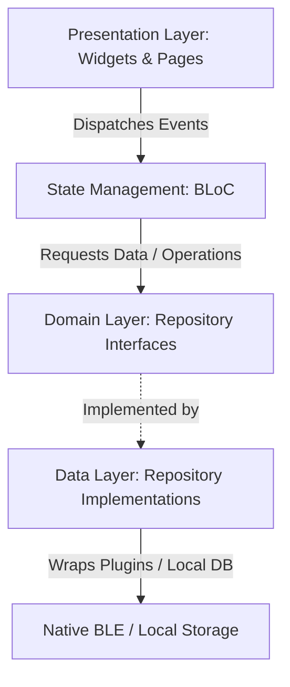

# Flutter BLE Clean Architecture Foundation

A production-grade, enterprise-ready Flutter architecture framework built for Bluetooth Low Energy (BLE) applications. This repository serves as a scalable, high-performance blueprint demonstrating mobile architecture best practices, native Swift/Kotlin platforms integration, robust telemetry logs, and test-driven development.

---

## 🏗️ Architecture Overview

The codebase is built on **Clean Architecture** principles, decoupled by boundaries that ensure scalability, maintainability, and testability.



### 1. Presentation Layer (`lib/features/`)
* **State Management**: Orchestrated via `flutter_bloc` using uni-directional data streams.
* **Navigation**: Modern declarative routing powered by `go_router`.
* **Theme**: Custom Material 3 Dark/Light themes designed with visual tokens.

### 2. Domain Layer (`lib/core/ble/domain/` & `lib/features/ble_logs/domain/`)
* Contains pure business contracts (Interfaces) and entities.
* Free from framework dependencies (e.g., UI or Bluetooth libraries).

### 3. Data Layer (`lib/core/ble/data/` & `lib/features/ble_logs/data/`)
* Concrete implementation of domain repository contracts.
* Maps third-party API events (e.g., `flutter_blue_plus` streams) into standard domain models (`BleDevice`, `BleConnectionStatus`).
* Manages local storage caching (Hive).

### 4. Shared & Injection Container (`lib/core/di/`)
* Dynamic dependency injection managed via `get_it` Service Locator.
* Bootstraps storage engines and logs handlers during initial zone startup.

---

## 🔒 Telemetry Logs & Log Capping

To ensure system reliability during heavy BLE scans or GATT communication, this codebase implements a **Hive-backed Telemetry Cache** (`BleLogsRepositoryImpl`):
* **No Code Generators**: Structured log models serialized as JSON strings inside a standard `Box<String>`, resolving conflicts with Dart 3 macro upgrades.
* **Log Capper**: Limits stored telemetry events to **500 entries** maximum. Old entries are automatically pruned on new writes to prevent performance degradation or out-of-memory crashes on device.
* **Terminal GUI**: Presentation logs screen styles messages with terminal-like monospaced typography and color codes representing message severity.

---

## 📱 Platform Permissions

BLE operations require system-level permission authorizations. The app integrates `permission_handler` and prompts the user on startup:

### Android (`android/app/src/main/AndroidManifest.xml`)
The following permissions are configured in the manifest:
* `android.permission.BLUETOOTH_SCAN` (with `neverForLocation` optional flag)
* `android.permission.BLUETOOTH_CONNECT`
* `android.permission.ACCESS_FINE_LOCATION` (Required for legacy Android APIs)

### iOS (`ios/Runner/Info.plist`)
The following usage descriptions are configured:
* `NSBluetoothAlwaysUsageDescription` (Background/Foreground peripheral communications)
* `NSBluetoothPeripheralUsageDescription` (Legacy peripheral access)
* `NSLocationWhenInUseUsageDescription` (Service discovery requirements)

---

## ⚡ Native Platform Code Integration

To demonstrate senior platform engineering, custom Kotlin and Swift BLE components have been designed as blueprints for native extensions when complex vendor SDKs or custom background daemon modes are needed:

### Kotlin Core (Android)
* [BleManager.kt](file:///Users/kshitijthakre/Development/Apps/flutter-ble-architecture/android/app/src/main/kotlin/com/kthakrebts/flutter_ble_architecture/BleManager.kt): Master MethodChannel bridge.
* [BleScanner.kt](file:///Users/kshitijthakre/Development/Apps/flutter-ble-architecture/android/app/src/main/kotlin/com/kthakrebts/flutter_ble_architecture/BleScanner.kt): Interfaces with `BluetoothLeScanner` for low-latency scanning.
* [BleConnectionManager.kt](file:///Users/kshitijthakre/Development/Apps/flutter-ble-architecture/android/app/src/main/kotlin/com/kthakrebts/flutter_ble_architecture/BleConnectionManager.kt): Manages active GATT instances.
* [GattCallbackHandler.kt](file:///Users/kshitijthakre/Development/Apps/flutter-ble-architecture/android/app/src/main/kotlin/com/kthakrebts/flutter_ble_architecture/GattCallbackHandler.kt): Inherits `BluetoothGattCallback` to track connection shifts.

### Swift Core (iOS)
* [BLEManager.swift](file:///Users/kshitijthakre/Development/Apps/flutter-ble-architecture/ios/Runner/BLEManager.swift): Master CoreBluetooth MethodChannel bridge.
* [BLEScanner.swift](file:///Users/kshitijthakre/Development/Apps/flutter-ble-architecture/ios/Runner/BLEScanner.swift): Orchestrates peripheral scanning using `CBCentralManager`.
* [BLEConnectionManager.swift](file:///Users/kshitijthakre/Development/Apps/flutter-ble-architecture/ios/Runner/BLEConnectionManager.swift): Wraps `CBPeripheral` references and GATT delegate callbacks.

---

## 🧪 Testing Guidelines

This project maintains unit tests covering presenter layers, events, and states using `mocktail` and `bloc_test`:

### Execute the Test Suite
Run tests inside the repository using the Flutter CLI:
```bash
flutter test
```

### Key Tests Written:
* **BLoC Unit Tests**: `BleScanBloc` states verification, event coverage, and stream subscription updates.
* **Widget Smoke Tests**: Ensures basic MaterialApp routing, injection containers integration, and initial splash screens rendering.

---

## 🛡️ HIPAA Compliance & Proprietary Code Disclaimer

> [!IMPORTANT]
> **HIPAA Compliance Disclaimer**
> 
> This repository is a clean, public-facing software architecture blueprint. It contains **no proprietary medical device integrations, clinical data logic, or proprietary code**. All core structures use standard public SDK APIs (`flutter_blue_plus`, `hive`, `flutter_bloc`). No Protected Health Information (PHI) is processed, collected, or transmitted. 

---

## 🛠️ Getting Started & Run Locally

1. **Prerequisites**: Ensure Flutter SDK `3.35.4` (or compatible 3.x) is installed.
2. **Install Dependencies**:
   ```bash
   flutter pub get
   ```
3. **Run Code Analysis**:
   ```bash
   flutter analyze
   ```
4. **Launch Application**:
   ```bash
   flutter run
   ```

---

## 💻 Tech Stack
* **Framework**: Flutter 3.x (with null-safety)
* **Language**: Dart 3.x, Kotlin (Android), Swift (iOS)
* **State Management**: flutter_bloc & equatable
* **Routing**: go_router
* **Local Storage**: Hive (caching logs)
* **BLE Core**: flutter_blue_plus

---

## 🗺️ Future Roadmap
1. **Secure Storage integration**: Encrypt peripheral keys using keychain/keystore.
2. **Auto-reconnect logic**: Implement automated reconnect policies inside BLoC handlers with exponential backoffs.
3. **Background daemon execution**: Setup native services to perform background BLE data collection.

---

## 📂 Additional Documentation
* Detailed architecture layers, state machine diagrams, and troubleshooting guidelines are located in the [architecture.md](docs/architecture.md) documentation file.

