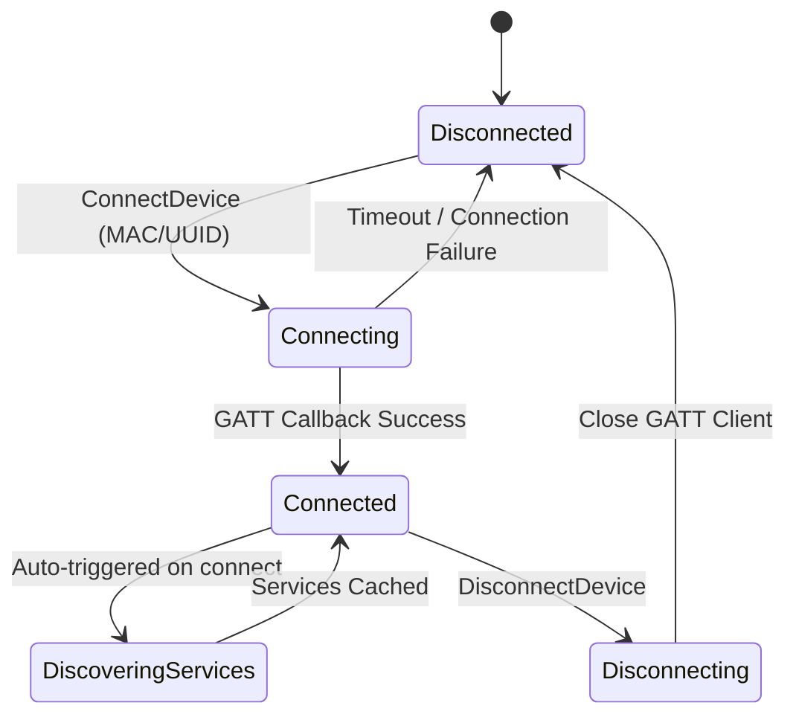

# Architectural Blueprint & Engineering Design

This document details the software design patterns, state diagrams, and troubleshooting guidelines for the Flutter BLE Clean Architecture starter kit.

---

## 🗺️ System State Transitions

---

## 🛠️ Troubleshooting & Diagnostics

### 1. Hive Storage Lock Exceptions
* **Issue**: `HiveError: The box "ble_logs_box" is already open and its type conflicts with...`
* **Resolution**: Ensure that the box is only initialized once in the dependency injection container (`initDI()`). Avoid opening the box in individual repositories. All features must request the database instance through the shared service locator (`sl<BleLogsRepository>()`).

### 2. Android SDK Gradle Mismatch
* **Issue**: Native compilation errors regarding Kotlin version compatibility or Gradle dependencies.
* **Resolution**: Verify that Android `compileSdk` is configured to `34` or higher in `android/app/build.gradle.kts` to satisfy permission constraints required by modern BLE scanning.

### 3. iOS CoreBluetooth Core State PoweredOff
* **Issue**: `CBCentralManager` reports state `poweredOff` and throws MethodChannel exceptions on scan.
* **Resolution**: Ensure Bluetooth is enabled in the iOS simulator settings or test on physical hardware. The iOS simulator does not support full peripheral BLE emulation out-of-the-box.

---

## 🚀 Future Roadmap & Scaling
* **Secure Cache**: Integrate `flutter_secure_storage` to encrypt sensitive device connection keys.
* **Auto-Reconnect Loop**: Implement exponential back-off retries inside `BleConnectionBloc` when peripherals disconnect unexpectedly.
* **DFU Firmware Updates**: Add abstractions for OTA firmware updates using native vendor packages.
